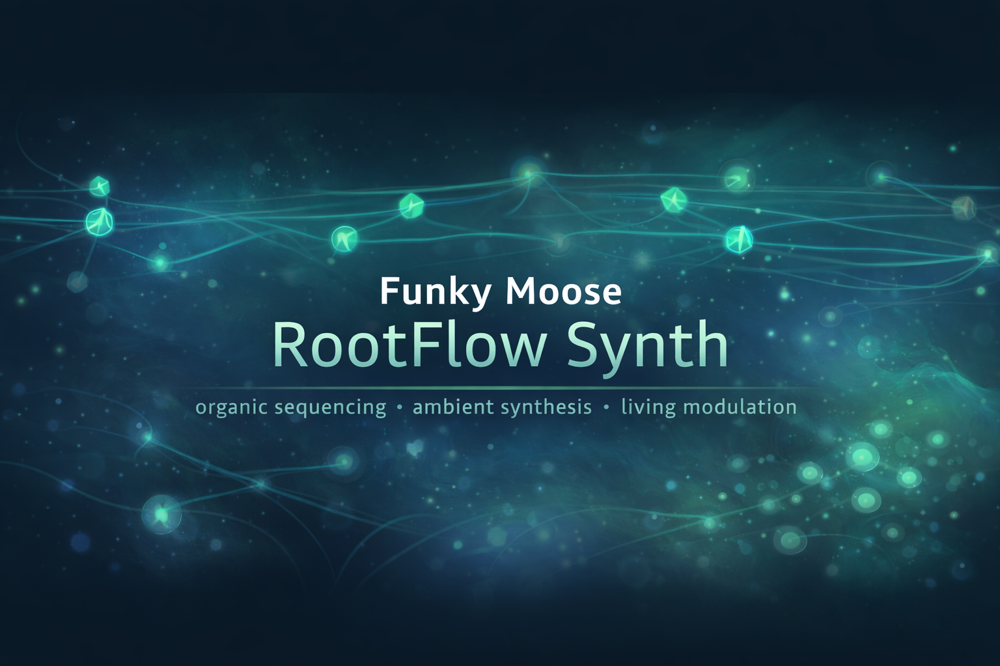
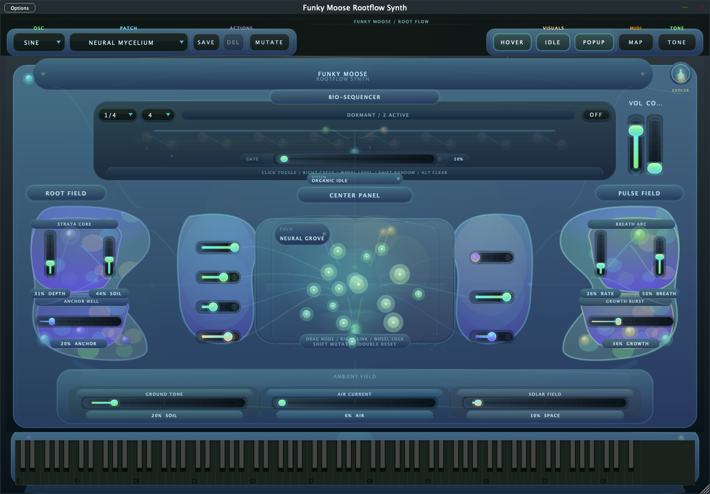

# Funky Moose Rootflow Synth




**Funky Moose Rootflow Synth** ist ein organisch reagierendes Software-Instrument, gebaut mit **JUCE** und **C++17**.

Es verbindet Ambient-Synthese, bio-inspirierte Sequenzen, lebendige Modulation und eine atmende Benutzeroberfläche zu einem Instrument, das sich eher gewachsen als zusammengeschraubt anfühlt. Rootflow soll nicht steril oder technisch wirken. Es soll atmen, pulsieren, driften und sich entwickeln.

## Download

Fertige Builds für macOS und Windows sind unter **[Releases](https://github.com/blubass/funky-moose-rootflow-synth/releases)** verfügbar.

Aktuelle Version: **v1.3.2**.

> [!IMPORTANT]
> **Für macOS-Nutzer**: Diese Builds sind derzeit nicht signiert. Du musst die App eventuell einmal per Rechtsklick im Finder öffnen ("Öffnen") oder sie in den **Systemeinstellungen > Datenschutz & Sicherheit** freigeben.

## Features

- Organische Synth-Engine für Texturen, Drones, Pulse und atmosphärische Sounds
- Bio-Sequencer für lebendige rhythmische Bewegung und mutationsgetriebene Pattern
- Reaktives Center Panel mit knotiger, organismischer Bewegung und visueller Rückmeldung
- Root-, Pulse- und Ambient-Felder für tonale Basis, Bewegung und Raumanteil
- Patch-Workflow mit Save-, Delete- und Mutate-Aktionen direkt im Hauptfenster
- Spielbare Keyboard-Oberfläche und direkte Performance-Kontrolle
- Verfügbar als **Audio Unit**, **VST3** und **Standalone** auf macOS

## Interface

### Bio-Sequencer
Ein Modulations-Sequencer für lebendige rhythmische Bewegungen. Er steuert Step-Aktivität, Mutationsverhalten und pulsartige Parameter-Modulationen.

### Center Panel
Das visuelle Zentrum. Es spiegelt Bewegung, Modulation und Interaktion in Echtzeit wider.

### Root Field
Steuert die tonale Basis, Tiefe und die Stabilität im tieffrequenten Bereich.

### Pulse Field
Steuert Bewegung, Rate, Atem und animierte Modulationen.

### Ambient Field
Steuert Raumanteil, Luftigkeit, den Charakter von Reverb/Delay und die Stereobreite.

### Version 1.3.2 (Aktuell)
- **DSP Parameter Smoothing**: Per-Sample-Interpolation für alle kritischen Effekt-Parameter (Mix, Delay, Feedback, Resonanz) zur Vermeidung von "Zipper Noise".
- **Musikalische ADSR-Kurven**: Exponentielle Formgebung der Hüllkurven für einen perkussiveren, analogen Charakter.
- **Filter Bite**: Dynamische Hüllkurven-Modulation auf den Filter-Cutoff für lebendigere Artikulation.
- **Unisono-Stabilität**: Stimmenanzahl wird jetzt beim Note-On fixiert, um Knackser bei Modulationen zu vermeiden.
- **Windows-CI repariert**: MSVC-Ambiguität in GitHub Actions behoben.
- **Preset-Wechsel stabil**: `masterVolume` bleibt beim Umschalten von Presets erhalten.
- **Standalone-Start abgesichert**: Null-Deref-Crash beim App-Start behoben.

## Screenshot



## Installation

### macOS
- **Audio Unit**: das `.component`-Bundle nach `~/Library/Audio/Plug-Ins/Components` kopieren
- **VST3**: das `.vst3`-Bundle nach `~/Library/Audio/Plug-Ins/VST3` kopieren
- **Standalone**: das `.app`-Bundle in `Applications` verschieben

### Hinweise
- Unsigned Builds müssen evtl. einmal über Finder geöffnet oder in `System Settings > Privacy & Security` erlaubt werden.
- Wenn du einen älteren `RootFlow`-Build ersetzt, sollte die DAW nach der Installation neu gescannt werden.

## Build from Source

Automatisierte CI-Builds für macOS und Windows werden über GitHub Actions erstellt.

### Voraussetzungen
- CMake 3.22 oder neuer
- JUCE 8.0.10
- C++17 kompatibler Compiler
- Xcode oder Xcode Command Line Tools auf macOS

### Schnellstart
```bash
git clone https://github.com/blubass/funky-moose-rootflow-synth.git
cd funky-moose-rootflow-synth
cmake --preset default
cmake --build --preset default
```

Das mitgelieferte Preset erwartet JUCE hier:
`$HOME/Developer/JUCE/install/lib/cmake/JUCE-8.0.10`

Falls JUCE woanders liegt, gib beim Konfigurieren `-DJUCE_DIR=/path/to/JUCE/lib/cmake/JUCE-8.0.10` an.

## Roadmap

### Demnächst
- Überarbeitung des Preset-Browsers
- Mehr Factory-Patches
- Aufräumarbeiten bei MIDI Learn / Host-Automation
- CPU-Profiling und Voice-Optimierung
- Verbesserte Anzeige des Modulations-Routings

### Später
- Erweiterte Oszillator-Modelle
- Mehr Bio-Sequencer Mutationsmodi
- Cross-Plattform Installer-Pakete
- Signierte/Notarisierte macOS-Builds

## Changelog

### [1.3.2] - 2026-04-28
- **Smooth Interaction**: Robuste Per-Sample-Parameter-Glättung für alle globalen Effekte.
- **Analog ADSR**: Hüllkurven auf exponentielle Charakteristik umgestellt für perkussivere Artikulation.
- **VCF Drive**: Hüllkurven-zu-Filter-Modulation integriert.
- **Bugfixes**: Windows-CI repariert und Unisono-Stimmverwaltung stabilisiert.

### [1.3.1] - 2026-04-20
- **Preset-Lautstärke**: `masterVolume` bleibt beim Preset-Wechsel erhalten.
- **Standalone-Crashfix**: Overlay-Update im Editor-Timer gegen veraltete Parameterzugriffe abgesichert.
- **Kompatibilität**: Legacy-Parameter-IDs werden in das neue Layout migriert.

### [1.3.0] - 2026-04-01
- **Audio Unit Build**: AU in den Standard-Presets wieder aktiviert.
- **macOS Packaging**: Universal-Build für Apple Silicon und Intel (Monterey+).

## Autor
Uwe Arthur Felchle
Musiker, Komponist, Produzent und Entwickler
[uwefelchle.at](https://uwefelchle.at)

## Lizenz
Dieses Projekt steht unter der MIT-Lizenz. Siehe [LICENSE](LICENSE).
